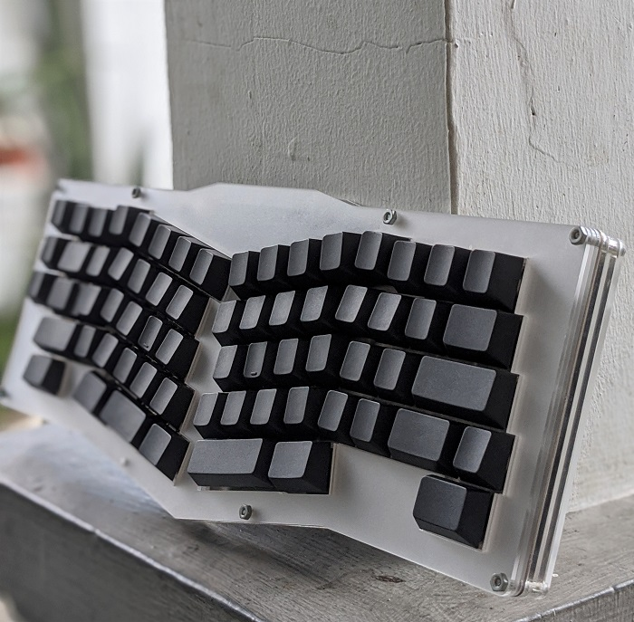
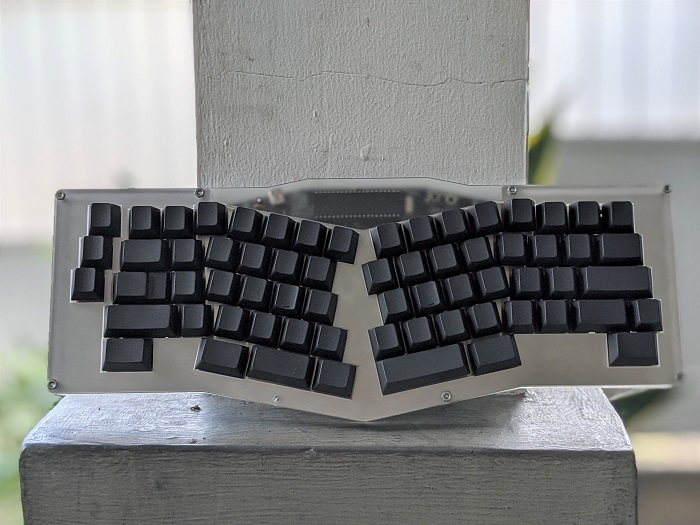

## Cookie
a prototype sandwich sesame keyboard case.

#### Guide

| File                 | Acrylic Thickness                  | Qty |
|----------------------|------------------------------------|-----|
| cookie-bottom.dxf    | 3mm                                | 1   |
| cookie-middle.dxf    | 5mm                                | 1   |
| cookie-middle.dxf    | 3mm                                | 1   |
| cookie-plate.dxf     | 1.5mm for metal or 3mm for acrylic | 1   |
| cookie-top-open.dxf  | 6mm (3x2mm) or 2x3mm                                | 1   |
| cookie-top-close.dxf | 2mm                                | 1   |

| Item          | Qty |
|---------------|-----|
| 20mm M3 Screw | 8   |
| M3 Nut        | 8   |

# DO WITH YOUR OWN RISK.
